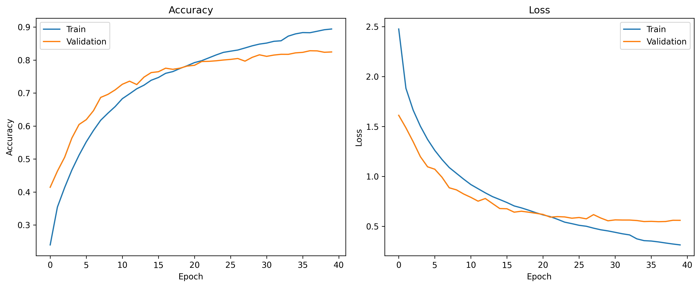
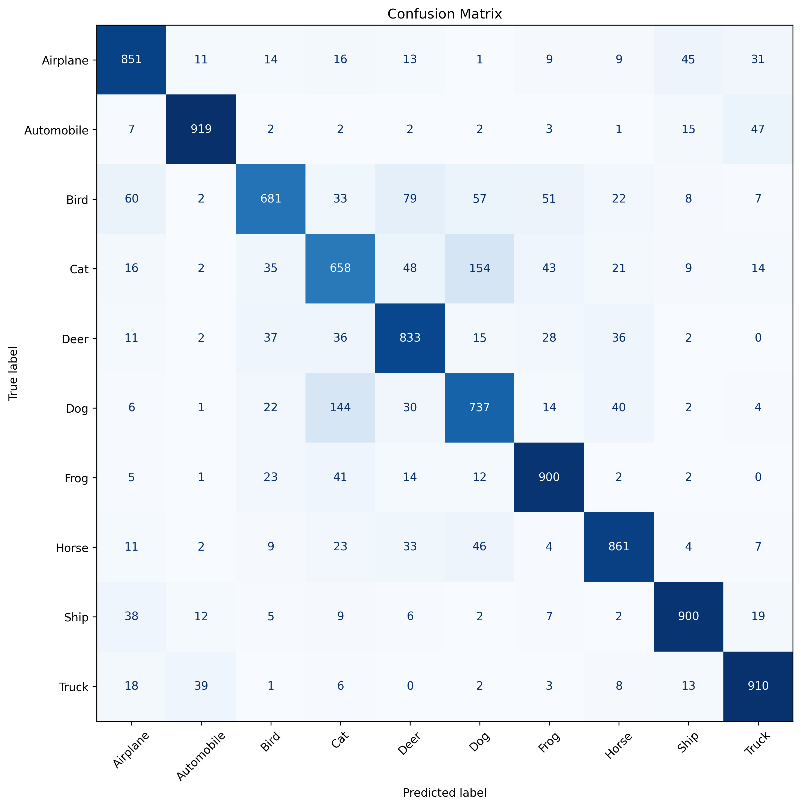
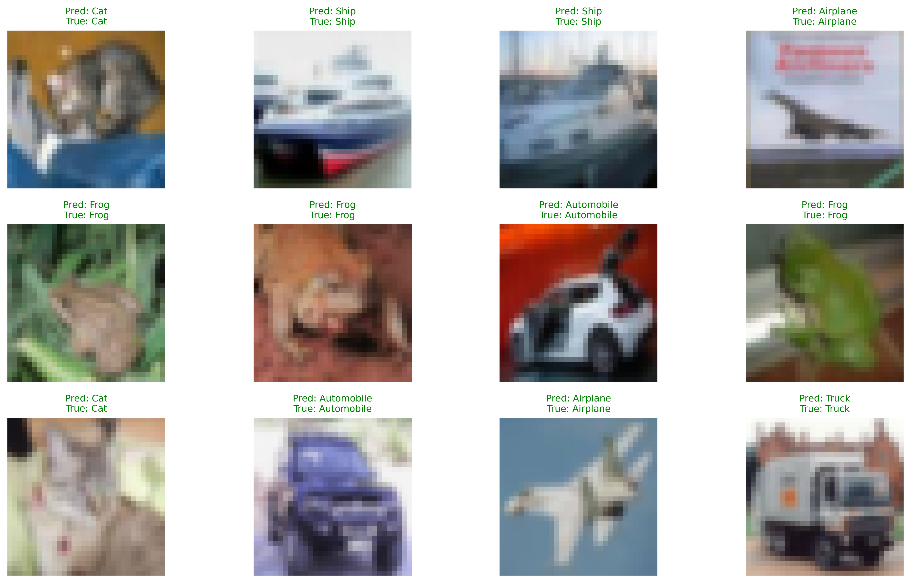

# CIFAR-10 Image Classification using Deep Learning

## About

This project was designed to gain practical experience with Deep Learning by building and evaluating Convolutional Neural Networks (CNNs) for image classification on the CIFAR-10 dataset.

We first developed a shared baseline model together and then independently experimented with different architectures and techniques to improve performance.

---

## Problem

Develop a CNN capable of accurately classifying images into the 10 CIFAR-10 categories while minimizing overfitting through systematic model experimentation.

**Dataset:** CIFAR-10 (60,000 RGB images, 10 classes) provided by the Canadian Institute for Advanced Research (CIFAR).

---

## Project Workflow

- Built a shared baseline CNN.
- Independently developed and tested multiple model variations.
- Compared different architectures, regularization techniques, callbacks, and Transfer Learning (VGG16).
- Selected **Model_cf_9** as the best-performing custom CNN based on validation accuracy and generalization.

### Individual Contributions

After developing the baseline model together, we explored different approaches independently.

- **Casilda** developed and evaluated the models following the naming convention **Model_cf_X** (e.g., `Model_cf_4`).
- **Felipe** developed and evaluated the models following the naming convention **Model_FM_X** (e.g., `Model_FM_5`).

Each contributor experimented with different CNN architectures, regularization techniques, and training strategies before comparing the results. Based on our evaluation, **Model_cf_9** achieved the best overall performance among the custom CNN models.

---
## Best Models

### Custom CNN (Model_cf_9)
**Architecture**
- 6 Convolutional layers
- Batch Normalization
- Dropout
- Max Pooling
- Dense classifier

**Training techniques**
- EarlyStopping
- ModelCheckpoint
- ReduceLROnPlateau

**Results**
- **Training Accuracy:** 90%
- **Validation Accuracy:** 83%

### Transfer Learning (VGG16)

A VGG16 Transfer Learning model was also implemented using ImageNet pretrained weights. While **Model_cf_9** achieved the best performance among the custom CNN architectures, the VGG16 model demonstrates the effectiveness of transfer learning and has been deployed with Gradio for real-time image classification.

---

## Results

The figures below summarize the performance of the best-performing custom CNN model, including the training history, confusion matrix, and sample predictions.

### Training Curves



### Confusion Matrix



### Sample Predictions



## Live Demo

The trained models can be tested through the following Gradio applications:

- **Felipe Martignon – VGG16 Transfer Learning**
  - [Launch Demo](https://ba4828aa997ef2a890.gradio.live)

- **Casilda Gil de Santivanes Finat – Custom CNN (Model_cf_9)**  
  *Coming soon*

---
## Tech Stack

- Python
- TensorFlow / Keras
- NumPy
- Matplotlib
- Scikit-learn
- Gradio
- Google Colab
---

## Installation

```bash
git clone https://github.com/Casildagsf/Ironhack-DL-Challenge-Group-8.git
cd Ironhack-DL-Challenge-Group-8

pip install -r requirements.txt
```

Open the notebooks in **Jupyter Notebook** or **Google Colab** to reproduce the experiments.


---

## Authors

**Casilda Gil de Santivanes Finat**  
GitHub: [Casildagsf](https://github.com/Casildagsf)

**Felipe Martignon**  
GitHub: [Martigol2](https://github.com/Martigol2)

